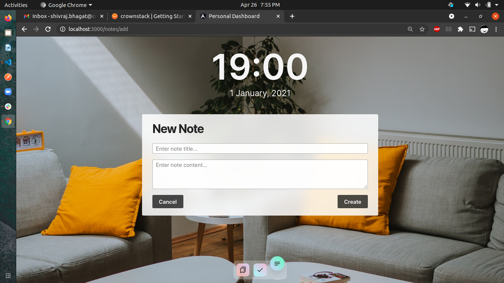

# PersonalDashboard

## 26th April Progress
Implemented frontends for the bookmarks, notes, todos and also add new notes. Here you see the below ss to help you understand:

## Development server

Run `ng serve` for a dev server. Navigate to `http://localhost:4200/`. The app will automatically reload if you change any of the source files.